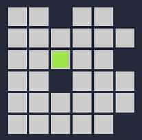
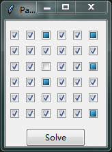
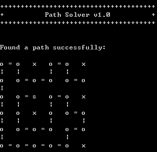

# Path Solver
## Inspiration
Inspiration of this tool comes from a mini game on Wechat. Given a grid and a starting cell, the goal of this game is to find a path from the starting cell that goes through all the other designated cells only once.

Below is an example grid from the game (with green cell being the starting cell):

-----

## Design process
On the frontend, I use Tkinter to create a GUI that allows users to draw the grid, which is then passed to the backend.

On the backend, the grid is represented as a connected graph, I then run DFS on the graph to find the path.

-----

## Usage
1. In terminal, change directory to "path_solver", then run "python path_solver.py [dimension]".

2. A [dimension] &times; [dimension] square grid will be generated on GUI, so [dimension] should least be the number of cells on the longer edge.

3. On GUI, according to the given grid, click twice on the checkbutton to represent the starting cell, click once on other checkbuttons to represent other designated cells.

&emsp;&emsp;&ensp; Below is the representation of the example grid above on GUI:

&emsp;&emsp;&ensp; 

4. Click on "Solve" button. The resulting path will be printed to the terminal (with "s" being the starting cell and "o" being other designated cells).

&emsp;&emsp;&ensp; Below is the resulting path for the example above:

&emsp;&emsp;&ensp; 
